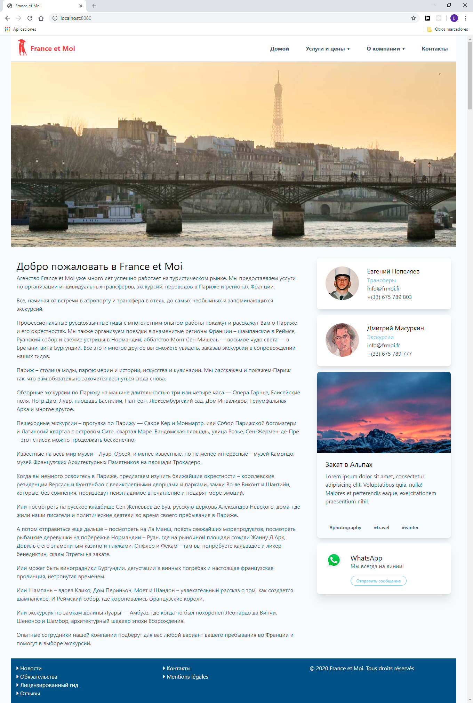
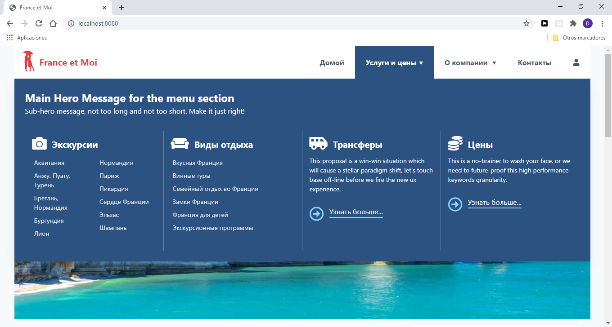
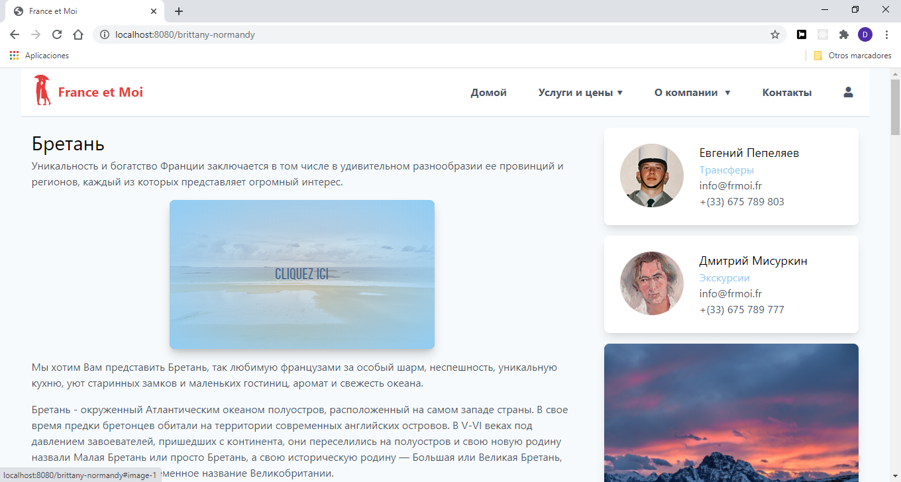
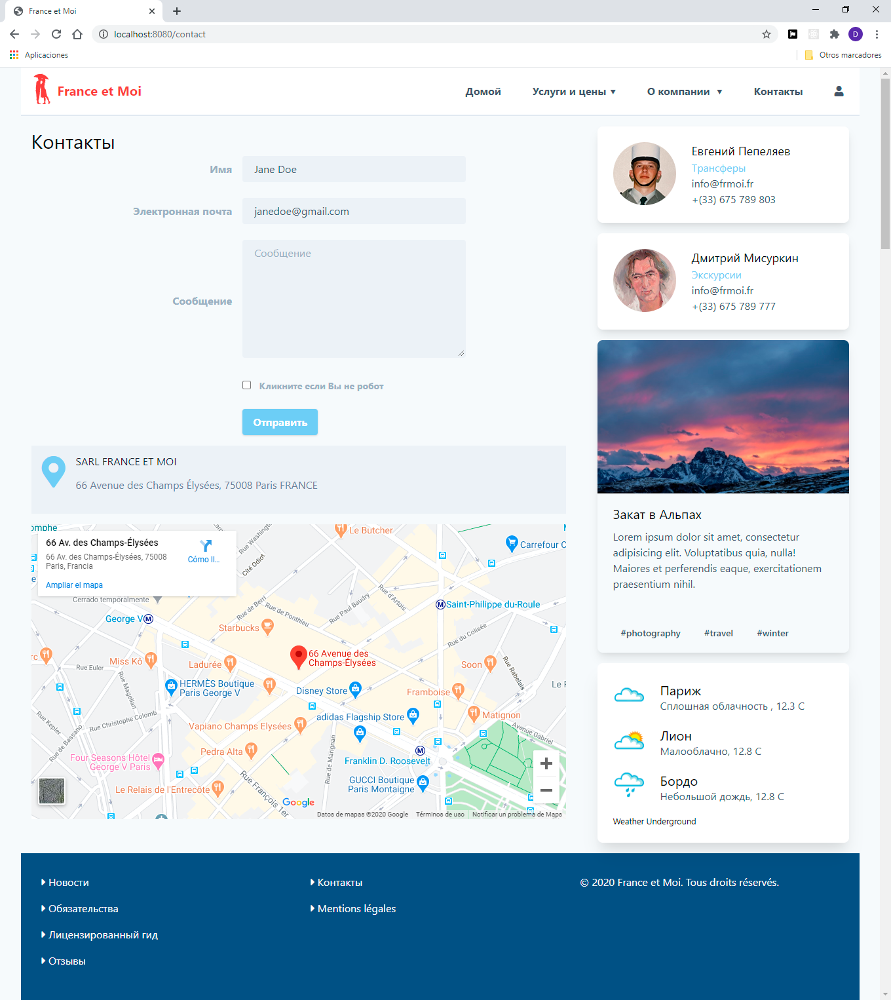
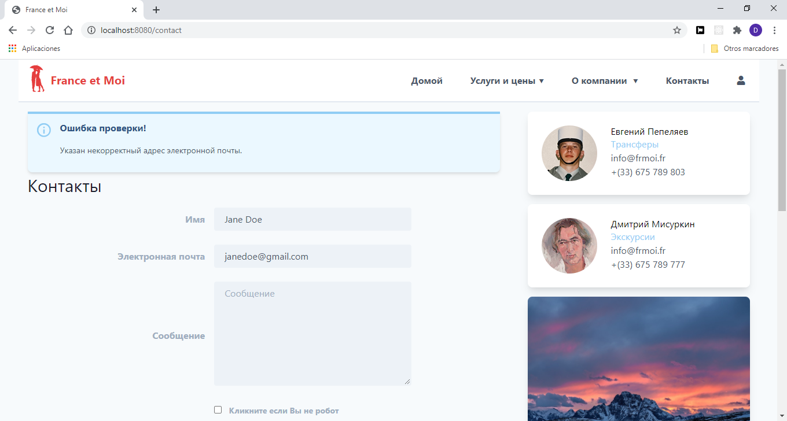
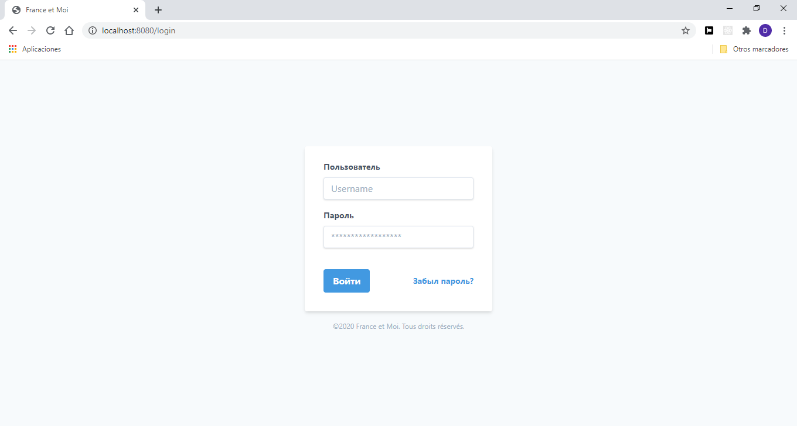

# France et Moi

**France et Moi** es la web de agencia de viajes personalizados. Se desarrolla con las siguientes fantasticas tecnologías:

* Node/Express
* MongoDB
* Handlebars
* Tailwind

#### De la caja:

* Validación de formularios del lado del cliente y del servidor
* Protección del SPAM
* Protección del CSRF
* Mensajes flash

#### Como arrancar

<pre><code>
  yarn
  yarn run app
</code></pre>

Para recibir los correos a su cuenta de Google hay que permitir el acceso de aplicaciones poco seguras:

<a href="https://myaccount.google.com/lesssecureapps" target="_blank">
  https://myaccount.google.com/lesssecureapps
</a>

También es necesario crear el fichero <code>credentials.js</code> con el siguiente contenido:

<pre><code>
  module.exports = {
    cookieSecret: 'frase secreta',
    gmail: {
      user: 'su correo de Gmail',
      password: 'su contraseña de Gmail'
    }
  }
</code></pre>

#### Licensia:

Eres libre y tienes derecho de hacer todo lo que quieres.

#### Pantallas:

Index ->

Mega Menu ->

Image rollover ->

Full size image ->

Contact ->

Flash messages ->

Login ->
